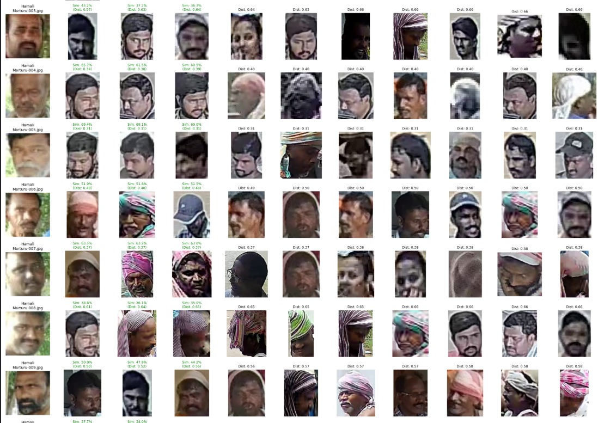

# Facial Recognition Dashboard with ArcFace on Kaggle

This project provides a robust solution for performing facial recognition on a large database of faces within the **Kaggle Notebooks environment**. It uses the state-of-the-art **ArcFace** model via the `deepface` library to compare a set of known "reference" individuals against a large database and generates a visual "dashboard" of the top matches for each person.

## Features

- **High-Accuracy Recognition:** Leverages the ArcFace model for reliable facial similarity scoring.
- **Efficient Database Processing:** Features a smart, one-time setup that pre-processes the entire face database. All subsequent searches within the same Kaggle session are extremely fast.
- **Visual Dashboards:** Generates detailed, side-by-side comparison plots for each reference person and their top matches from the database.
- **Customizable Thresholds:** Easily filter matches based on a similarity distance threshold to ensure only high-confidence results are shown.
- **Organized for Roles:** Designed to handle reference faces categorized by roles (e.g., DEO, Hamali, Incharge) and locations.

## Project Structure
algorithm/
└── Face Recognition (Using Arcface)/
├── README.md <-- You are here
├── requirements.txt <-- A list of key dependencies (for reference)
├── face_recognition_arcface.ipynb <-- The main Kaggle Notebook with the code
└── assets/
└── sample_output.png <-- An example of a generated dashboard


## Setup and How to Run on Kaggle

This project is designed to be run entirely on Kaggle. No local setup is required.

1.  **Create a New Kaggle Notebook:**
    - Go to Kaggle and create a new notebook.

2.  **Enable Internet and GPU:**
    - In the notebook's right-hand settings panel, turn the **Internet** switch **ON**.
    - For faster processing, set the **Accelerator** to **GPU** (e.g., T4 x2).

3.  **Prepare Your Data on Kaggle:**
    - Upload your two main data sources as separate Kaggle Datasets. Make sure they are **private**.
    - **Main Database:** A dataset containing all 3500+ individual face images.
    - **Reference Faces:** A dataset organized with the following structure:
        ```
        reference_faces/
        ├── Bapatla/
        │   ├── Bapatla-deo.jpg
        │   ├── Bapatla-hamali.jpg
        │   └── Bapatla-incharge.jpg
        ├── Guduru/
        │   ├── Guduru-deo.jpg
        │   └── ...
        └── ...
        ```

4.  **Add Datasets to Notebook:**
    - In your notebook, click `+ Add Input`. You will need to add two datasets.
    - **Main Database (3500+ Faces):**
        - Find and add the public dataset: [APCSC Instance Seg YOLO](https://www.kaggle.com/datasets/asapannarakesh/2025-06-26-apscscl-instance-seg-yolo)
        - The specific folder we use from this dataset is `/2025-06-27-class_crops/class_crops/face/`.
    - **Reference Faces (12 Locations):**
        - Find and add the public dataset: [Reference Data for Verification](https://www.kaggle.com/datasets/epitomeofcode/referencedata)
        - The folder structure within this dataset is `/faces/[LocationName]/[Role].jpg`.

5.  **Run the Code:**
    - Copy the code from the `face_recognition_arcface.ipynb` file in this repository into the cells of your Kaggle Notebook.
    - **Update the paths** in the "Configuration" cell to match the paths Kaggle assigned to your datasets (e.g., `/kaggle/input/my-main-db/`, `/kaggle/input/my-reference-faces/faces/`).
    - Run the cells in order.
        - The first cell will install `deepface`.
        - The "One-Time Database Setup" cell will take **15-20 minutes** the first time you run it in a new session. It processes all faces and saves the results to `/kaggle/working/`.
        - All subsequent runs *within the same session* will be very fast. The final cells will generate and display the dashboard images.

## Sample Output

The script will generate a visual dashboard for each location, showing the reference person and their top matches from the database.

 (this is just for one location)

